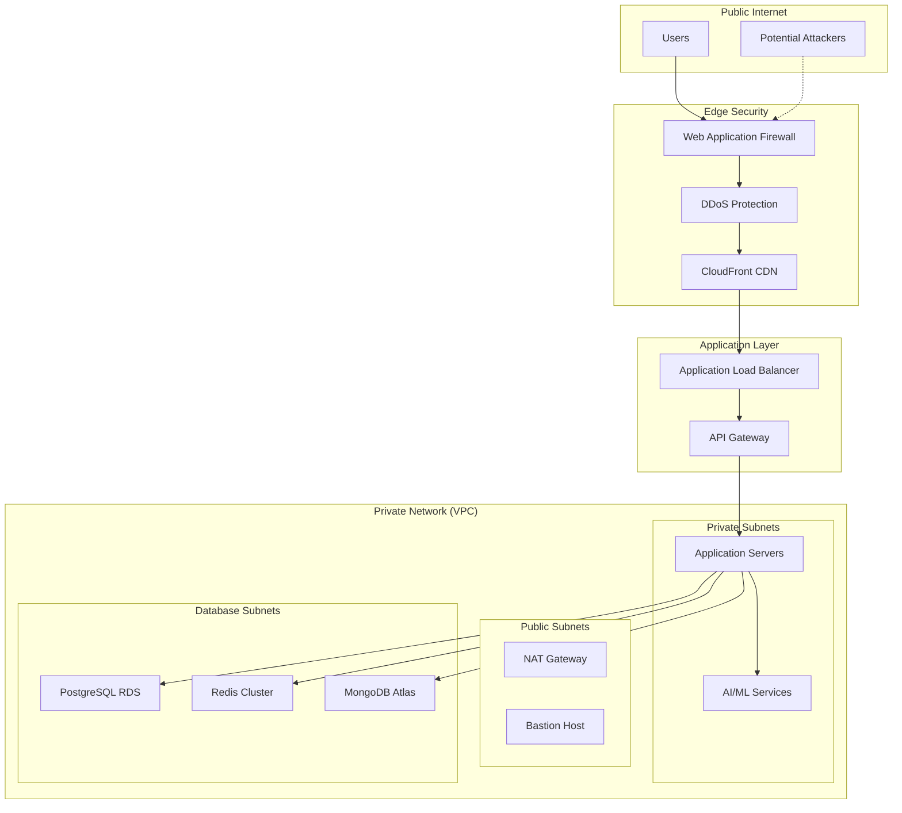

# Design Document: AI Media Platform

## Overview

The AI Media Platform is a comprehensive, enterprise-scale system designed to revolutionize content creation, personalization, optimization, and distribution across multiple digital channels. The platform leverages advanced AI technologies including large language models, computer vision, and machine learning to provide intelligent content generation and management capabilities.

### Key Design Principles

- **Microservices Architecture**: Modular, independently deployable services for scalability and maintainability
- **Event-Driven Design**: Asynchronous processing for high throughput and responsiveness
- **API-First Approach**: RESTful APIs with comprehensive documentation for integration
- **Cloud-Native**: Designed for containerized deployment with auto-scaling capabilities
- **Security by Design**: End-to-end encryption, zero-trust architecture, and comprehensive audit logging
- **Performance Optimization**: Sub-3-second response times with intelligent caching and CDN integration

## Architecture

### High-Level System Architecture

```mermaid
graph TB
    subgraph "Client Layer"
        WEB[Web Application]
        MOBILE[Mobile Apps]
        API_CLIENT[API Clients]
    end
    
    subgraph "API Gateway Layer"
        GATEWAY[API Gateway]
        AUTH[Authentication Service]
        RATE_LIMIT[Rate Limiting]
    end
    
    subgraph "Core Services"
        CONTENT_GEN[Content Generation Service]
        PERSONALIZATION[Personalization Engine]
        OPTIMIZER[Content Optimizer]
        DISTRIBUTION[Distribution Manager]
        ANALYTICS[Analytics Engine]
        CONTENT_MGMT[Content Management Service]
    end
    
    subgraph "AI/ML Layer"
        LLM[Large Language Models]
        VISION[Computer Vision Models]
        AUDIO_AI[Audio AI Models]
        ML_PIPELINE[ML Pipeline Service]
    end
    
    subgraph "Data Layer"
        CONTENT_DB[(Content Database)]
        USER_DB[(User Database)]
        ANALYTICS_DB[(Analytics Database)]
        CACHE[(Redis Cache)]
        BLOB_STORAGE[(Blob Storage)]
    end
    
    subgraph "External Integrations"
        SOCIAL[Social Media APIs]
        CMS[CMS Integrations]
        CDN[Content Delivery Network]
        MONITORING[Monitoring & Logging]
    end
    
    WEB --> GATEWAY
    MOBILE --> GATEWAY
    API_CLIENT --> GATEWAY
    
    GATEWAY --> AUTH
    GATEWAY --> RATE_LIMIT
    GATEWAY --> CONTENT_GEN
    GATEWAY --> PERSONALIZATION
    GATEWAY --> OPTIMIZER
    GATEWAY --> DISTRIBUTION
    GATEWAY --> ANALYTICS
    GATEWAY --> CONTENT_MGMT
    
    CONTENT_GEN --> LLM
    CONTENT_GEN --> VISION
    CONTENT_GEN --> AUDIO_AI
    OPTIMIZER --> ML_PIPELINE
    PERSONALIZATION --> ML_PIPELINE
    
    CONTENT_GEN --> CONTENT_DB
    CONTENT_GEN --> BLOB_STORAGE
    PERSONALIZATION --> USER_DB
    ANALYTICS --> ANALYTICS_DB
    CONTENT_MGMT --> CACHE
    
    DISTRIBUTION --> SOCIAL
    DISTRIBUTION --> CMS
    DISTRIBUTION --> CDN
    
    ANALYTICS --> MONITORING
```



### Technology Stack

**Backend Services**:
- **Runtime**: Node.js with TypeScript for API services, Python for AI/ML services
- **Framework**: Express.js for REST APIs, FastAPI for ML services
- **Message Queue**: Apache Kafka for event streaming, Redis for caching
- **Database**: PostgreSQL for relational data, MongoDB for content metadata, ClickHouse for analytics

**AI/ML Infrastructure**:
- **LLM Integration**: OpenAI GPT-4, Anthropic Claude, local Llama models
- **Computer Vision**: Stable Diffusion, DALL-E, custom CNN models
- **Audio Processing**: Whisper for transcription, custom TTS models
- **ML Framework**: PyTorch, TensorFlow, Hugging Face Transformers

**Infrastructure**:
- **Container Orchestration**: Kubernetes with Helm charts
- **Cloud Provider**: AWS (primary), multi-cloud support
- **Storage**: Amazon S3 for blob storage, EFS for shared file systems
- **CDN**: CloudFront with custom edge locations
- **Monitoring**: Prometheus, Grafana, ELK stack

**Security**:
- **Authentication**: Auth0 with JWT tokens, OAuth 2.0/OIDC
- **Encryption**: AES-256 for data at rest, TLS 1.3 for data in transit
- **Secrets Management**: AWS Secrets Manager, HashiCorp Vault
- **Network Security**: VPC with private subnets, WAF, DDoS protection

## Components and Interfaces

### Content Generation Service

**Responsibilities**:
- Orchestrate AI model requests for text, image, video, and audio generation
- Manage generation queues and resource allocation
- Handle model selection and parameter optimization
- Provide generation status tracking and progress updates

**Key Interfaces**:

```typescript
interface ContentGenerationRequest {
  type: 'text' | 'image' | 'video' | 'audio';
  prompt: string;
  parameters: GenerationParameters;
  userId: string;
  priority: 'low' | 'normal' | 'high';
}

interface GenerationParameters {
  style?: string;
  dimensions?: { width: number; height: number };
  duration?: number;
  targetAudience?: string;
  tone?: string;
  format?: string;
}

interface ContentGenerationResponse {
  id: string;
  status: 'queued' | 'processing' | 'completed' | 'failed';
  progress: number;
  result?: GeneratedContent;
  estimatedCompletion?: Date;
  error?: string;
}

interface GeneratedContent {
  contentUrl: string;
  metadata: ContentMetadata;
  alternatives?: GeneratedContent[];
}
```

**API Endpoints**:
- `POST /api/v1/content/generate` - Submit generation request
- `GET /api/v1/content/generate/{id}` - Get generation status
- `GET /api/v1/content/generate/{id}/result` - Download generated content
- `DELETE /api/v1/content/generate/{id}` - Cancel generation request

### Personalization Engine

**Responsibilities**:
- Analyze user behavior and preferences
- Generate personalized content recommendations
- Adapt content for different audience segments
- Provide real-time personalization decisions

**Key Interfaces**:

```typescript
interface PersonalizationRequest {
  userId: string;
  contentIds: string[];
  context: PersonalizationContext;
  maxResults: number;
}

interface PersonalizationContext {
  deviceType: string;
  location?: string;
  timeOfDay: string;
  sessionHistory: string[];
  demographics?: UserDemographics;
}

interface PersonalizationResponse {
  recommendations: PersonalizedContent[];
  confidence: number;
  reasoning: string[];
}

interface PersonalizedContent {
  contentId: string;
  score: number;
  adaptations: ContentAdaptation[];
}

interface ContentAdaptation {
  type: 'tone' | 'style' | 'format' | 'length';
  originalValue: string;
  adaptedValue: string;
  reason: string;
}
```

### Content Optimizer

**Responsibilities**:
- Analyze existing content for improvement opportunities
- Suggest performance-based optimizations
- Convert content between different formats
- Ensure accessibility compliance

**Key Interfaces**:

```typescript
interface OptimizationRequest {
  contentId: string;
  optimizationType: 'performance' | 'accessibility' | 'seo' | 'format';
  targetMetrics?: string[];
  constraints?: OptimizationConstraints;
}

interface OptimizationConstraints {
  maxLength?: number;
  requiredKeywords?: string[];
  accessibilityLevel?: 'A' | 'AA' | 'AAA';
  targetPlatforms?: string[];
}

interface OptimizationResponse {
  optimizedContent: OptimizedContent;
  improvements: Improvement[];
  performancePrediction: PerformancePrediction;
}

interface Improvement {
  type: string;
  description: string;
  impact: 'low' | 'medium' | 'high';
  confidence: number;
}
```

### Distribution Manager

**Responsibilities**:
- Manage multi-channel content publishing
- Handle platform-specific formatting and requirements
- Schedule content publication across time zones
- Track distribution status and handle failures

**Key Interfaces**:

```typescript
interface DistributionRequest {
  contentId: string;
  channels: DistributionChannel[];
  schedule?: ScheduleConfig;
  adaptations?: ChannelAdaptation[];
}

interface DistributionChannel {
  platform: 'facebook' | 'twitter' | 'instagram' | 'linkedin' | 'website' | 'email';
  accountId: string;
  configuration: PlatformConfiguration;
}

interface ScheduleConfig {
  publishAt: Date;
  timeZone: string;
  recurring?: RecurrencePattern;
}

interface DistributionResponse {
  distributionId: string;
  status: DistributionStatus[];
  scheduledPublications: ScheduledPublication[];
}

interface DistributionStatus {
  channel: string;
  status: 'pending' | 'published' | 'failed' | 'scheduled';
  publishedUrl?: string;
  error?: string;
  publishedAt?: Date;
}
```

### Analytics Engine

**Responsibilities**:
- Collect and process performance metrics from all channels
- Generate insights and trend analysis
- Provide real-time dashboards and reporting
- Detect performance anomalies and alert users

**Key Interfaces**:

```typescript
interface AnalyticsQuery {
  contentIds?: string[];
  channels?: string[];
  metrics: string[];
  timeRange: TimeRange;
  groupBy?: string[];
  filters?: AnalyticsFilter[];
}

interface TimeRange {
  start: Date;
  end: Date;
  granularity: 'hour' | 'day' | 'week' | 'month';
}

interface AnalyticsResponse {
  data: MetricDataPoint[];
  insights: Insight[];
  summary: MetricSummary;
}

interface MetricDataPoint {
  timestamp: Date;
  contentId: string;
  channel: string;
  metrics: Record<string, number>;
}

interface Insight {
  type: 'trend' | 'anomaly' | 'recommendation';
  description: string;
  confidence: number;
  actionable: boolean;
}
```

## Data Models

### Core Content Model

```typescript
interface ContentItem {
  id: string;
  type: 'text' | 'image' | 'video' | 'audio';
  title: string;
  description?: string;
  content: ContentData;
  metadata: ContentMetadata;
  tags: string[];
  createdBy: string;
  createdAt: Date;
  updatedAt: Date;
  version: number;
  status: 'draft' | 'published' | 'archived';
  permissions: ContentPermissions;
}

interface ContentData {
  originalUrl: string;
  processedUrls: Record<string, string>; // format -> URL
  thumbnailUrl?: string;
  duration?: number; // for video/audio
  dimensions?: { width: number; height: number }; // for images/video
  fileSize: number;
  mimeType: string;
}

interface ContentMetadata {
  generationParams?: GenerationParameters;
  aiModel?: string;
  processingHistory: ProcessingStep[];
  performanceMetrics?: PerformanceMetrics;
  seoData?: SEOMetadata;
  accessibilityData?: AccessibilityMetadata;
}
```

### User and Organization Model

```typescript
interface User {
  id: string;
  email: string;
  profile: UserProfile;
  preferences: UserPreferences;
  organizationId?: string;
  role: UserRole;
  permissions: Permission[];
  createdAt: Date;
  lastLoginAt?: Date;
  isActive: boolean;
}

interface UserProfile {
  firstName: string;
  lastName: string;
  avatar?: string;
  timezone: string;
  language: string;
  demographics?: UserDemographics;
}

interface UserPreferences {
  contentTypes: string[];
  preferredStyles: string[];
  notificationSettings: NotificationSettings;
  privacySettings: PrivacySettings;
}

interface Organization {
  id: string;
  name: string;
  domain: string;
  subscription: SubscriptionPlan;
  settings: OrganizationSettings;
  integrations: Integration[];
  createdAt: Date;
}
```

### Analytics and Performance Model

```typescript
interface PerformanceMetrics {
  contentId: string;
  channel: string;
  metrics: {
    views: number;
    clicks: number;
    shares: number;
    likes: number;
    comments: number;
    conversions: number;
    engagementRate: number;
    reachRate: number;
    timeSpent: number;
  };
  timestamp: Date;
  period: 'hour' | 'day' | 'week' | 'month';
}

interface AnalyticsEvent {
  id: string;
  eventType: string;
  contentId: string;
  userId?: string;
  sessionId: string;
  channel: string;
  properties: Record<string, any>;
  timestamp: Date;
  ipAddress?: string;
  userAgent?: string;
}
```

## Database Schema Design

### PostgreSQL Schema (Primary Database)

```sql
-- Users and Organizations
CREATE TABLE organizations (
    id UUID PRIMARY KEY DEFAULT gen_random_uuid(),
    name VARCHAR(255) NOT NULL,
    domain VARCHAR(255) UNIQUE,
    subscription_plan VARCHAR(50) NOT NULL,
    settings JSONB DEFAULT '{}',
    created_at TIMESTAMP WITH TIME ZONE DEFAULT NOW(),
    updated_at TIMESTAMP WITH TIME ZONE DEFAULT NOW()
);

CREATE TABLE users (
    id UUID PRIMARY KEY DEFAULT gen_random_uuid(),
    email VARCHAR(255) UNIQUE NOT NULL,
    password_hash VARCHAR(255),
    profile JSONB NOT NULL DEFAULT '{}',
    preferences JSONB NOT NULL DEFAULT '{}',
    organization_id UUID REFERENCES organizations(id),
    role VARCHAR(50) NOT NULL DEFAULT 'user',
    permissions TEXT[] DEFAULT '{}',
    is_active BOOLEAN DEFAULT true,
    created_at TIMESTAMP WITH TIME ZONE DEFAULT NOW(),
    last_login_at TIMESTAMP WITH TIME ZONE,
    updated_at TIMESTAMP WITH TIME ZONE DEFAULT NOW()
);

-- Content Management
CREATE TABLE content_items (
    id UUID PRIMARY KEY DEFAULT gen_random_uuid(),
    type VARCHAR(20) NOT NULL CHECK (type IN ('text', 'image', 'video', 'audio')),
    title VARCHAR(500) NOT NULL,
    description TEXT,
    content_data JSONB NOT NULL,
    metadata JSONB DEFAULT '{}',
    tags TEXT[] DEFAULT '{}',
    created_by UUID NOT NULL REFERENCES users(id),
    organization_id UUID REFERENCES organizations(id),
    version INTEGER DEFAULT 1,
    status VARCHAR(20) DEFAULT 'draft' CHECK (status IN ('draft', 'published', 'archived')),
    permissions JSONB DEFAULT '{}',
    created_at TIMESTAMP WITH TIME ZONE DEFAULT NOW(),
    updated_at TIMESTAMP WITH TIME ZONE DEFAULT NOW()
);

CREATE INDEX idx_content_items_type ON content_items(type);
CREATE INDEX idx_content_items_created_by ON content_items(created_by);
CREATE INDEX idx_content_items_organization ON content_items(organization_id);
CREATE INDEX idx_content_items_tags ON content_items USING GIN(tags);
CREATE INDEX idx_content_items_status ON content_items(status);

-- Content Generation Tracking
CREATE TABLE generation_requests (
    id UUID PRIMARY KEY DEFAULT gen_random_uuid(),
    user_id UUID NOT NULL REFERENCES users(id),
    content_type VARCHAR(20) NOT NULL,
    prompt TEXT NOT NULL,
    parameters JSONB DEFAULT '{}',
    status VARCHAR(20) DEFAULT 'queued' CHECK (status IN ('queued', 'processing', 'completed', 'failed')),
    progress INTEGER DEFAULT 0 CHECK (progress >= 0 AND progress <= 100),
    result_content_id UUID REFERENCES content_items(id),
    error_message TEXT,
    estimated_completion TIMESTAMP WITH TIME ZONE,
    created_at TIMESTAMP WITH TIME ZONE DEFAULT NOW(),
    completed_at TIMESTAMP WITH TIME ZONE
);

-- Distribution Tracking
CREATE TABLE distributions (
    id UUID PRIMARY KEY DEFAULT gen_random_uuid(),
    content_id UUID NOT NULL REFERENCES content_items(id),
    channels JSONB NOT NULL,
    schedule_config JSONB,
    status JSONB NOT NULL DEFAULT '{}',
    created_by UUID NOT NULL REFERENCES users(id),
    created_at TIMESTAMP WITH TIME ZONE DEFAULT NOW(),
    updated_at TIMESTAMP WITH TIME ZONE DEFAULT NOW()
);

-- Integrations
CREATE TABLE integrations (
    id UUID PRIMARY KEY DEFAULT gen_random_uuid(),
    organization_id UUID NOT NULL REFERENCES organizations(id),
    platform VARCHAR(50) NOT NULL,
    configuration JSONB NOT NULL,
    credentials_encrypted TEXT,
    is_active BOOLEAN DEFAULT true,
    created_at TIMESTAMP WITH TIME ZONE DEFAULT NOW(),
    updated_at TIMESTAMP WITH TIME ZONE DEFAULT NOW()
);
```

### MongoDB Schema (Content Metadata and Flexible Data)

```javascript
// Content metadata collection for flexible, schema-less data
db.content_metadata.createIndex({ "contentId": 1 });
db.content_metadata.createIndex({ "aiModel": 1 });
db.content_metadata.createIndex({ "tags": 1 });
db.content_metadata.createIndex({ "createdAt": 1 });

// User behavior and preferences
db.user_behavior.createIndex({ "userId": 1, "timestamp": 1 });
db.user_behavior.createIndex({ "contentId": 1 });
db.user_behavior.createIndex({ "sessionId": 1 });

// Content processing history
db.processing_history.createIndex({ "contentId": 1, "timestamp": 1 });
db.processing_history.createIndex({ "processingType": 1 });
```

### ClickHouse Schema (Analytics and Time-Series Data)

```sql
-- Analytics events table optimized for time-series queries
CREATE TABLE analytics_events (
    event_id String,
    event_type String,
    content_id String,
    user_id String,
    session_id String,
    channel String,
    properties String, -- JSON string
    timestamp DateTime64(3),
    date Date MATERIALIZED toDate(timestamp),
    hour UInt8 MATERIALIZED toHour(timestamp),
    ip_address String,
    user_agent String
) ENGINE = MergeTree()
PARTITION BY toYYYYMM(date)
ORDER BY (date, hour, event_type, content_id)
SETTINGS index_granularity = 8192;

-- Performance metrics aggregated table
CREATE TABLE performance_metrics (
    content_id String,
    channel String,
    date Date,
    hour UInt8,
    views UInt64,
    clicks UInt64,
    shares UInt64,
    likes UInt64,
    comments UInt64,
    conversions UInt64,
    total_time_spent UInt64,
    unique_users UInt64
) ENGINE = SummingMergeTree()
PARTITION BY toYYYYMM(date)
ORDER BY (date, hour, channel, content_id)
SETTINGS index_granularity = 8192;
```

## Security Architecture

### Authentication and Authorization

**Multi-Factor Authentication Flow**:
1. Primary authentication via email/password or SSO
2. Optional MFA via TOTP, SMS, or hardware tokens
3. JWT token issuance with short expiration (15 minutes)
4. Refresh token rotation for extended sessions

**Role-Based Access Control (RBAC)**:
```typescript
enum Role {
  SUPER_ADMIN = 'super_admin',
  ORG_ADMIN = 'org_admin',
  CONTENT_MANAGER = 'content_manager',
  CONTENT_CREATOR = 'content_creator',
  VIEWER = 'viewer'
}

enum Permission {
  // Content permissions
  CREATE_CONTENT = 'content:create',
  READ_CONTENT = 'content:read',
  UPDATE_CONTENT = 'content:update',
  DELETE_CONTENT = 'content:delete',
  PUBLISH_CONTENT = 'content:publish',
  
  // Analytics permissions
  VIEW_ANALYTICS = 'analytics:view',
  EXPORT_ANALYTICS = 'analytics:export',
  
  // Admin permissions
  MANAGE_USERS = 'users:manage',
  MANAGE_INTEGRATIONS = 'integrations:manage',
  MANAGE_BILLING = 'billing:manage'
}
```

### Data Encryption and Privacy

**Encryption Strategy**:
- **Data at Rest**: AES-256 encryption for all databases and file storage
- **Data in Transit**: TLS 1.3 for all API communications
- **Key Management**: AWS KMS with automatic key rotation
- **PII Encryption**: Field-level encryption for sensitive user data

**Privacy Controls**:
- **Data Minimization**: Collect only necessary data for functionality
- **Consent Management**: Granular consent tracking and management
- **Right to Erasure**: Automated data deletion workflows
- **Data Portability**: Export user data in standard formats

### Network Security



## Performance Considerations

### Caching Strategy

**Multi-Layer Caching**:
1. **CDN Caching**: Static assets and generated content (24-hour TTL)
2. **Application Caching**: API responses and computed results (Redis, 1-hour TTL)
3. **Database Caching**: Query result caching (PostgreSQL shared_buffers)
4. **Browser Caching**: Client-side caching with cache-busting for updates

**Cache Invalidation**:
- **Event-driven**: Invalidate cache on content updates
- **Time-based**: Automatic expiration for dynamic data
- **Manual**: Admin controls for emergency cache clearing

### Auto-Scaling Configuration

**Horizontal Pod Autoscaler (HPA)**:
```yaml
apiVersion: autoscaling/v2
kind: HorizontalPodAutoscaler
metadata:
  name: content-generation-hpa
spec:
  scaleTargetRef:
    apiVersion: apps/v1
    kind: Deployment
    name: content-generation-service
  minReplicas: 3
  maxReplicas: 50
  metrics:
  - type: Resource
    resource:
      name: cpu
      target:
        type: Utilization
        averageUtilization: 70
  - type: Resource
    resource:
      name: memory
      target:
        type: Utilization
        averageUtilization: 80
```

**Vertical Pod Autoscaler (VPA)**:
- Automatic resource request/limit adjustments
- Historical usage analysis for optimization
- Separate VPA for AI/ML workloads with GPU requirements

### Performance Monitoring

**Key Performance Indicators (KPIs)**:
- **Response Time**: 95th percentile < 3 seconds
- **Throughput**: 10,000 requests per minute per service
- **Availability**: 99.9% uptime SLA
- **Error Rate**: < 0.1% for critical operations

**Monitoring Stack**:
- **Metrics**: Prometheus with custom metrics
- **Logging**: ELK stack with structured logging
- **Tracing**: Jaeger for distributed tracing
- **Alerting**: PagerDuty integration for critical alerts

## Integration Patterns

### API Design Patterns

**RESTful API Standards**:
- **Resource-based URLs**: `/api/v1/content/{id}`
- **HTTP Methods**: GET, POST, PUT, DELETE, PATCH
- **Status Codes**: Consistent use of HTTP status codes
- **Pagination**: Cursor-based pagination for large datasets
- **Versioning**: URL-based versioning with backward compatibility

**GraphQL Integration**:
```graphql
type Query {
  content(id: ID!): Content
  contents(
    filter: ContentFilter
    sort: ContentSort
    pagination: PaginationInput
  ): ContentConnection
  
  analytics(
    contentIds: [ID!]
    timeRange: TimeRangeInput
    metrics: [MetricType!]
  ): AnalyticsData
}

type Mutation {
  generateContent(input: GenerationInput!): GenerationResult
  optimizeContent(id: ID!, options: OptimizationOptions!): OptimizationResult
  distributeContent(id: ID!, channels: [ChannelInput!]!): DistributionResult
}

type Subscription {
  generationProgress(requestId: ID!): GenerationProgress
  analyticsUpdates(contentId: ID!): AnalyticsUpdate
}
```

### Webhook System

**Webhook Events**:
- `content.generated` - Content generation completed
- `content.published` - Content published to channel
- `analytics.threshold` - Performance threshold reached
- `user.action` - User interaction events

**Webhook Delivery**:
- **Retry Logic**: Exponential backoff with maximum 5 retries
- **Security**: HMAC signature verification
- **Reliability**: Dead letter queue for failed deliveries
- **Monitoring**: Delivery success rate tracking

### Third-Party Integrations

**Social Media Platforms**:
```typescript
interface SocialMediaAdapter {
  platform: string;
  authenticate(credentials: PlatformCredentials): Promise<AuthResult>;
  publish(content: ContentItem, options: PublishOptions): Promise<PublishResult>;
  getMetrics(postId: string): Promise<PlatformMetrics>;
  validateContent(content: ContentItem): ValidationResult;
}

class FacebookAdapter implements SocialMediaAdapter {
  platform = 'facebook';
  
  async publish(content: ContentItem, options: PublishOptions): Promise<PublishResult> {
    // Facebook Graph API integration
    const formattedContent = this.formatForFacebook(content);
    const response = await this.facebookAPI.post('/me/feed', formattedContent);
    return { success: true, postId: response.id, url: response.permalink_url };
  }
}
```

**CMS Integrations**:
- **WordPress**: REST API and webhook integration
- **Drupal**: JSON:API integration
- **Contentful**: Management API integration
- **Strapi**: REST API integration

## Deployment Architecture

### Kubernetes Deployment

**Namespace Organization**:
```yaml
# Production namespace
apiVersion: v1
kind: Namespace
metadata:
  name: ai-media-platform-prod
  labels:
    environment: production
    
---
# Staging namespace
apiVersion: v1
kind: Namespace
metadata:
  name: ai-media-platform-staging
  labels:
    environment: staging
```

**Service Deployment Example**:
```yaml
apiVersion: apps/v1
kind: Deployment
metadata:
  name: content-generation-service
  namespace: ai-media-platform-prod
spec:
  replicas: 3
  selector:
    matchLabels:
      app: content-generation-service
  template:
    metadata:
      labels:
        app: content-generation-service
    spec:
      containers:
      - name: content-generation
        image: ai-media-platform/content-generation:v1.2.3
        ports:
        - containerPort: 3000
        env:
        - name: DATABASE_URL
          valueFrom:
            secretKeyRef:
              name: database-credentials
              key: url
        - name: REDIS_URL
          valueFrom:
            secretKeyRef:
              name: redis-credentials
              key: url
        resources:
          requests:
            memory: "512Mi"
            cpu: "250m"
          limits:
            memory: "1Gi"
            cpu: "500m"
        livenessProbe:
          httpGet:
            path: /health
            port: 3000
          initialDelaySeconds: 30
          periodSeconds: 10
        readinessProbe:
          httpGet:
            path: /ready
            port: 3000
          initialDelaySeconds: 5
          periodSeconds: 5
```

### CI/CD Pipeline

**GitOps Workflow**:

```mermaid
graph LR
    DEV[Developer] --> GIT[Git Repository]
    GIT --> CI[CI Pipeline]
    CI --> BUILD[Build & Test]
    BUILD --> SECURITY[Security Scan]
    SECURITY --> REGISTRY[Container Registry]
    REGISTRY --> CD[CD Pipeline]
    CD --> STAGING[Staging Environment]
    STAGING --> TESTS[Integration Tests]
    TESTS --> PROD[Production Deployment]
    
    PROD --> MONITOR[Monitoring]
    MONITOR --> ALERT[Alerting]
    ALERT --> DEV
```


**Pipeline Stages**:
1. **Code Quality**: ESLint, Prettier, SonarQube analysis
2. **Testing**: Unit tests, integration tests, property-based tests
3. **Security**: SAST, DAST, dependency vulnerability scanning
4. **Build**: Docker image creation with multi-stage builds
5. **Deploy**: Helm chart deployment with blue-green strategy

### Infrastructure as Code

**Terraform Configuration**:
```hcl
# VPC and Networking
module "vpc" {
  source = "terraform-aws-modules/vpc/aws"
  
  name = "ai-media-platform-vpc"
  cidr = "10.0.0.0/16"
  
  azs             = ["us-west-2a", "us-west-2b", "us-west-2c"]
  private_subnets = ["10.0.1.0/24", "10.0.2.0/24", "10.0.3.0/24"]
  public_subnets  = ["10.0.101.0/24", "10.0.102.0/24", "10.0.103.0/24"]
  
  enable_nat_gateway = true
  enable_vpn_gateway = true
  
  tags = {
    Environment = "production"
    Project     = "ai-media-platform"
  }
}

# EKS Cluster
module "eks" {
  source = "terraform-aws-modules/eks/aws"
  
  cluster_name    = "ai-media-platform"
  cluster_version = "1.27"
  
  vpc_id     = module.vpc.vpc_id
  subnet_ids = module.vpc.private_subnets
  
  node_groups = {
    general = {
      desired_capacity = 3
      max_capacity     = 10
      min_capacity     = 3
      
      instance_types = ["t3.large"]
      
      k8s_labels = {
        Environment = "production"
        NodeGroup   = "general"
      }
    }
    
    gpu = {
      desired_capacity = 1
      max_capacity     = 5
      min_capacity     = 0
      
      instance_types = ["p3.2xlarge"]
      
      k8s_labels = {
        Environment = "production"
        NodeGroup   = "gpu"
      }
      
      taints = [
        {
          key    = "nvidia.com/gpu"
          value  = "true"
          effect = "NO_SCHEDULE"
        }
      ]
    }
  }
}
```

Now I need to complete the design document with the Correctness Properties section. Let me first use the prework tool to analyze the acceptance criteria from the requirements.
